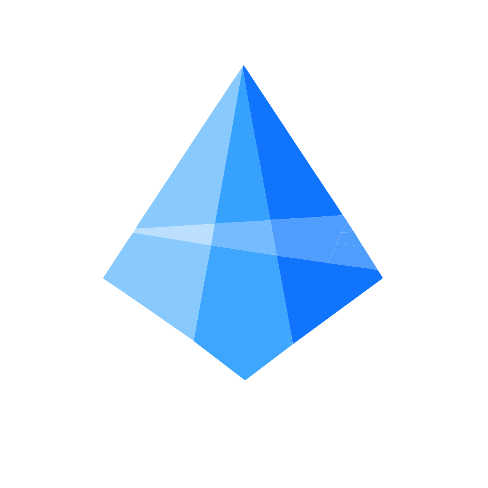

# HimmelCAD

HimmelCAD is an offline-first 3D, CAD, and photogrammetry platform. Its active
desktop products are **HimmelCAD Builder** and **HimmelCAD PhotoLab**;
**HimmelCAD WeltView** is the shared browser viewer. **HimmelCAD ChronoGit**,
**HimmelCAD Composer**, and **HimmelCAD TestFlight** remain reserved product
tracks.

The project is designed around three constraints from day one:

- very large 3D datasets must stay interactive,
- Builder projects must later be viewable in a browser,
- the data model must preserve enough semantic history for undo/redo and a
  future CAD-diff system.

## Products

| Product              | Purpose                                                                           | Status                                       |
| -------------------- | --------------------------------------------------------------------------------- | -------------------------------------------- |
| HimmelCAD Builder    | Desktop CAD for point clouds, 3D entities, segmentation, measurement, and drawing | Foundation maintained; productization paused |
| HimmelCAD PhotoLab   | Offline photogrammetry, survey products, meshes, and Gaussian splats              | Active productization                        |
| HimmelCAD WeltView   | Browser viewer for shared HimmelCAD projects and measurements                     | Shared viewer foundation                     |
| HimmelCAD ChronoGit  | Semantic versioning and diffing for CAD projects                                  | Reserved feasibility track                   |
| HimmelCAD Composer   | Precision-mechanics and manufacturing-oriented sibling product                    | Reserved; no application yet                 |
| HimmelCAD TestFlight | Scripted simulations such as runoff, wind, and vehicle sweep paths                | Reserved feasibility track                   |

The implemented application roots are `apps/builder`, `apps/photolab`, and
`apps/weltview`. Composer, TestFlight, and ChronoGit are reserved product names;
they do not currently have application directories.

## Branding

The original vector masters are kept unchanged under
[`branding/logos/source`](branding/logos/source). PNG and ICO platform assets
are generated deterministically with `pnpm branding:generate`. Desktop app
icons use the original mark on a black rounded card, while title bars keep the
un-carded mark.

| Product            | Primary mark                                                                                            | Notes                                                                    |
| ------------------ | ------------------------------------------------------------------------------------------------------- | ------------------------------------------------------------------------ |
| HimmelCAD Builder  |  | “Azure Tech” is primary; “Hoodie Ready” is retained as a reserve master. |
| HimmelCAD PhotoLab |        | Low-poly PhotoLab master supplied by the product owner.                  |

## Current Direction

- Shell: Electron for Builder and PhotoLab, static web bundle for WeltView.
- UI: TypeScript, React, Vite, Zustand, Tailwind-style design tokens.
- 3D: three.js plus modular point-cloud loading based on `pnext/three-loader`
  concepts, not a monolithic Potree v1 application fork.
- Core: Rust workspace exposed through a sidecar JSON-RPC bridge for Electron
  and a browser-compatible WASM surface for WeltView.
- Storage: hybrid `.hcad/` folder project with `.hcadx` export bundle.
- Data model: immutable, content-addressable entities with command journal.

## Important Files

- `AGENTS.md` - binding project rules and AI-agent instructions.
- `docs/CURRENT-DIRECTION.md` - what to build now, parallel lanes, scope freezes.
- `docs/PRODUCT-VISION.md` - product family, long-term entity scope, scripting direction.
- `docs/ROADMAP.md` - product roadmap (partly historical until rebaselined).
- `docs/MVP-PLAN.md` - implementation plan for the first MVP.
- `docs/ARCHITECTURE.md` - system architecture and core trade-offs.
- `docs/DATA-MODEL.md` - entity, attribute, command, and undo model.
- `docs/PROJECT-FORMAT.md` - `.hcad/` and `.hcadx` storage format.
- `docs/OPEN-QUESTIONS.md` - product and architecture decisions still needing answers.
- `docs/adr/0001-stack.md` - first architecture decision record.
- `docs/adr/0004-large-geometry-contracts.md` - shared contracts for tiled
  geometry, render budgets, picking and snapping targets.
- `docs/adr/0016-canonical-entity-model.md` - canonical entities and optional Z.
- `docs/adr/0017-unified-render-core.md` - unified render-core direction.
- `docs/adr/0018-canonical-io-provider-contract.md` - provider-neutral canonical import/export boundary.
- `docs/adr/0019-canonical-document-authority.md` - document commands versus view attachment/residency.

## License

HimmelCAD is source-available under BSL 1.1. Private, non-commercial forking and
self-building are allowed. Commercial use requires a separate license.

Dependencies must be compatible with this model. GPL/LGPL/AGPL/SSPL code must
not be incorporated into the product. See `AGENTS.md`.
