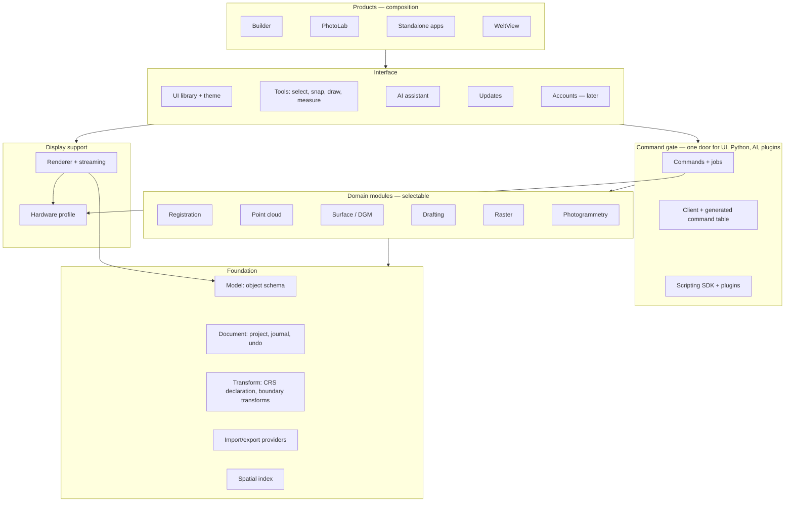

# Himmel:CAD architecture

This document describes current system boundaries. Accepted ADRs contain the
decision rationale and override this overview when details conflict.

## Architectural goals

- One canonical platform shared by Builder, PhotoLab, Cap import, and WeltView.
- Precise, crash-safe, journaled project state outside the UI.
- One renderer for CAD, point clouds, meshes, rasters, splats, and product views.
- Large-data interaction with bounded CPU, memory, storage, and GPU work.
- The same product capabilities available to UI, Python, and AI automation.
- Product-specific workflows without product-specific sources of truth.

## Module map

Decision: ADR 0032. Dependencies point only downward. Foundation, command
gate, display and interface modules are shared; domain modules are selected per
product. A product or standalone app is a composition: domain modules plus a
layout.



| Module               | Owns                                                                                                                                    | Must not                                            | Today in                                                                                                                                    |
| -------------------- | --------------------------------------------------------------------------------------------------------------------------------------- | --------------------------------------------------- | ------------------------------------------------------------------------------------------------------------------------------------------- |
| Model                | Object types, properties, states, validation, typed artifacts. Object data only — view appearance and residency live elsewhere.         | Know files, GPU, UI, products.                      | `core::{entity*, property_schema, canonical_resources, typed_artifact, mesh_surface, geometry_representation_registry}`                     |
| Document             | Project store, commands with expected revisions, journal, undo/redo, archive, durable/atomic files, format migrations.                  | Contain domain algorithms.                          | `core::{canonical_document, entity_commands}`, `sidecar::{canonical_project_store, project_archive, durable_fs, publish_fs}`                |
| Transform            | Project CRS declaration; transformation library used only by import, registration and export.                                           | Run inside measurement, construction or display.    | `core::{transform, transform_geometry, photolab_crs}`, `sidecar::{crs_*, transform_*, site_calibration_reader}`                             |
| Import/export        | Format providers: probe, stage, validate, report losses, map to the model.                                                              | Mutate the project or a viewer directly.            | `himmelcad-io`                                                                                                                              |
| Spatial              | Spatial indexes and queries.                                                                                                            | —                                                   | `himmelcad-spatial`                                                                                                                         |
| Commands + jobs      | Command registry, protocol dispatch from registrations, long-running jobs (progress, cancel, admission, concurrency), worker processes. | Hold product-specific branches.                     | `core::app_protocol`, `sidecar::{main, job_runtime, process_group, worker_toolchain, automation_runtime, canonical_app_runtime}`            |
| Domain modules       | One field each (registration, point cloud, surface/DGM, drafting, raster, photogrammetry). Register commands, jobs, panels, tools.      | Depend on another product; bypass the command gate. | spread over `sidecar`, `core::photolab_*`, app `App.tsx` files                                                                              |
| Hardware profile     | Machine detection, per-device quirk rules, render and compute budgets, GPU backend choice.                                              | Be bypassed by vendor checks elsewhere.             | `render::{hardware_policy, gpu_calibration}`, `sidecar::hardware_runtime`, job memory plan, Electron `rendererFallback.ts` and GPU switches |
| Renderer + streaming | One wgpu engine: scene, camera, picking, clipping, residency, streaming.                                                                | Depend on domain modules or products.               | `himmelcad-render`, `himmelcad-wasm`, `@himmelcad/viewer`                                                                                   |
| Client               | Typed protocol clients, generated command table.                                                                                        | Contain interaction logic.                          | `@himmelcad/app` (clients), `@himmelcad/data`                                                                                               |
| Tools                | Selection, snapping, drawing input, measurement, construction input.                                                                    | Mutate outside commands.                            | `@himmelcad/app` (interaction), viewer picking/snapping, app `App.tsx`                                                                      |
| UI library + theme   | Shared controls, surfaces, typography, motion, tokens.                                                                                  | Import Electron or domain logic.                    | `@himmelcad/ui`, `@himmelcad/theme`                                                                                                         |
| Scripting + plugins  | Python SDK over the automation protocol; out-of-process plugins with granted rights; bulk data by leases.                               | Use a private access path.                          | `sdk/`, `packages/@himmelcad/automation-host`                                                                                               |
| AI assistant         | Chat surface, harness adapters, trust grants. Acts only through scripting.                                                              | Own capabilities beyond the protocol.               | `@himmelcad/agent`, `@himmelcad/console`                                                                                                    |
| Updates              | Download, verify, install; warnings for incompatible changes. Project compatibility itself is the document's migrations.                | —                                                   | ADR 0029, app `electron`                                                                                                                    |

## Runtime tiers

```text
Product hosts            Builder / PhotoLab / WeltView / Cap (Electron + React, browser, Flutter)
Rust sidecar             kernel (protocol, commands, jobs, document) + selected domain crates
Compute workers          isolated, inventory-pinned processes (COLMAP, MVS, splat, …)
Render core              wgpu engine, in the renderer process through WASM
```

### Product hosts

Desktop products use Electron with React renderers. WeltView is a browser host.
Cap is a Flutter mobile host whose `.hcap` output enters the canonical platform
through the shared IO boundary.

Hosts own product composition, transient interaction state, and platform
integration. They do not own canonical entities, format parsers, rendering
truth, or alternate mutation paths.

### Canonical platform

Rust owns canonical project state, validation, commands, persistence, IO,
spatial operations, and durable operation state. React, Flutter, Python, and AI
clients observe or invoke this authority through versioned contracts.

`CanonicalDocument` is the mutable entity authority. Every semantic create,
update, delete, restore, property edit, or relation change is a validated command
with expected revisions and an append-only journal entry. Undo and redo append
compensating commands; they do not rewind history.

Viewer attachment, GPU residency, and canonical entity lifetime are separate
lifecycles. A render failure never rolls canonical state back to match a cache.

## Runtime boundaries

### Desktop

Electron main processes provide narrowly scoped platform services such as
window lifecycle, secure file selection, package updates, and sidecar
supervision. Renderers use a minimal preload API with context isolation,
disabled Node integration, and sandboxing.

The Rust sidecar owns projects and long-running operations. Compute workers are
isolated, inventory-pinned, and replaceable. Workers write scratch outputs; only
the sidecar validates and publishes canonical results.

### Browser

WeltView uses the shared viewer facade and browser-compatible WASM contracts. It
may attach read-only document snapshots without receiving canonical mutation
authority.

### Mobile

Cap owns capture and package creation, not reconstruction. Native platform
channels may expose camera and sensor capabilities. `.hcap` remains the stable
handoff to PhotoLab.

## Renderer

ADR 0017 defines one platform-neutral Rust render core built on `wgpu`.

- WebGPU is the primary browser and Electron backend.
- WebGL2 is the permanent downlevel backend of the same engine.
- Native backends remain available through wgpu where product hosts require
  them.
- One render world owns camera, depth, picking, clipping, selection, streaming,
  residency, and resource budgets.

New integrations use `@himmelcad/viewer/kernel`. The historical React/Three.js
surface and `@himmelcad/three-loader` are isolated compatibility paths during
app migration. They are not the target architecture and must not gain new
product behavior.

Formats are providers, not render engines. Potree, 3D Tiles/glTF, prepared
meshes, rasters, splats, and authored CAD all map into shared capabilities and
the global residency coordinator.

## Large-data and coordinate invariants

- Canonical world and camera values use `f64`; GPU payloads use local `f32`
  coordinates with explicit `f64` transforms.
- Z is up. Missing Z is unknown, never zero.
- Projects compute in one Cartesian system at scale 1 (metres or declared
  imperial units). The project CRS is a declaration; real CRS transformations
  happen only at import, registration and export (ADR 0032).
- Source coordinates are immutable unless an explicit journaled operation
  creates a new revision.
- No implicit CRS, grid, axis, height, scale, or unit conversion is allowed.
- Complete large datasets do not live permanently in product renderers or WASM
  memory.
- Importers prepare hierarchies, indexes, bounds, statistics, and GPU-friendly
  artifacts before interactive use.
- Runtime selection, decode, upload, picking, and eviction are bounded and
  cancellation-aware.

## IO and publication

ADR 0018 defines provider-neutral import and export. Providers probe, stage,
validate, report losses, and return canonical packages. They never mutate a
viewer or product-specific store directly.

Interactive import registration is a reviewed pre-commit lifecycle. It may
collect CRS decisions, point pairs, placement, and refinement input. PhotoLab
batch execution begins only from a fully resolved immutable plan and never
pauses for new user input.

Publication is transactional: immutable artifacts are complete and verified
before the canonical command commits. Cancellation or failure before commit
does not expose partial entities.

## Operation coordination

Every operation declares its scope, resources, mutation authority,
cancellation identity, and conflict behavior. Product hosts must not infer
parallel safety from separate buttons or panels.

For every new operation, decide whether overlapping work is:

- safely concurrent because it reads immutable snapshots or disjoint resources;
- coordinated through shared budgets or a common operation owner;
- serialized because it mutates the same project or external target; or
- rejected with a clear user-facing reason.

Cancellation, close, project replacement, sidecar restart, undo/redo, and app
shutdown are part of the same lifecycle design. Operation IDs and capabilities
must not survive their owner or leak into a later operation.

## Automation

ADR 0024 defines a versioned language-neutral protocol over canonical queries,
commands, view control, and bounded bulk-data leases. Generated sync and async
Python clients and AI harness adapters use that protocol.

Product UI may provide richer composition, but a domain capability must not
exist only as component-local logic. Pure presentation details such as hover or
panel animation are not canonical automation operations.

## Shared UI architecture

`@himmelcad/ui` and `@himmelcad/theme` are Electron-free. Apps compose shared
modules and add domain content. A recurring interaction pattern belongs in the
shared library before a second app copies it.

## Related decisions

- ADR 0016 — canonical entity model.
- ADR 0017 — unified render core.
- ADR 0018 — canonical IO provider contract.
- ADR 0019 — canonical document authority.
- ADR 0022 — shared 3D, 2D, and 2.5D view modes.
- ADR 0024 — automation and agent trust boundary.
- ADR 0025 — interactive import registration.
- ADR 0032 — module architecture and the CRS as a declaration.
