# PhotoLab — GCP and shared-viewer workflow validation

Project: `Untitled-2026-07-18T13-53-39-821Z.hcad`, 135 images, six GCPs, aligned sparse cloud and 135 camera overlays.

## Result

The PhotoLab 3D workspace now uses the shared kernel viewer. Camera and GCP overlay publication is serialized with readbacks so switching between images, GCP filtering and 3D no longer recursively borrows the Rust/WASM viewer object.

Image previews are prepared and used for the large photo list/filter workflow; the original image fades in only for the active high-resolution workspace.

The complete Optimize Alignment path was executed successfully:

- Operation: `gcp-optimize-6b1327f6-d5b8-46b9-bdd8-318693367e08`
- Published product artifact: `b1712fdf64b56ccd100045e597d27470f9f91d1315fc82834a1b2e9f83c6f144`
- 135 optimized cameras, 50,000 tie points, 257 output projections
- Converged in 65 iterations
- Checkpoint 3D RMS: 0.0177 m; checkpoint reprojection RMS: 0.0618 px

Twelve deterministic, exact-projection measurements were added as workflow-validation seeds across wide-baseline image pairs; the original manual `gcp260706.003` observation in image 12 was retained. Its existing 29 px disagreement dominates that GCP's residual and should be remeasured before treating the product as a survey deliverable.

## Visual record

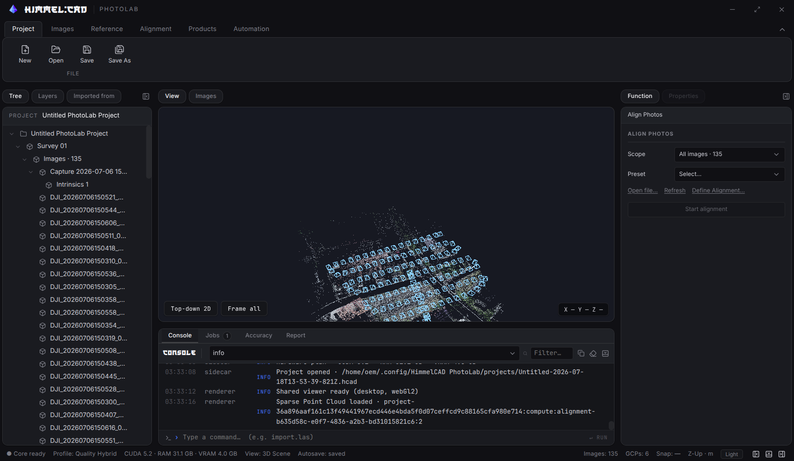

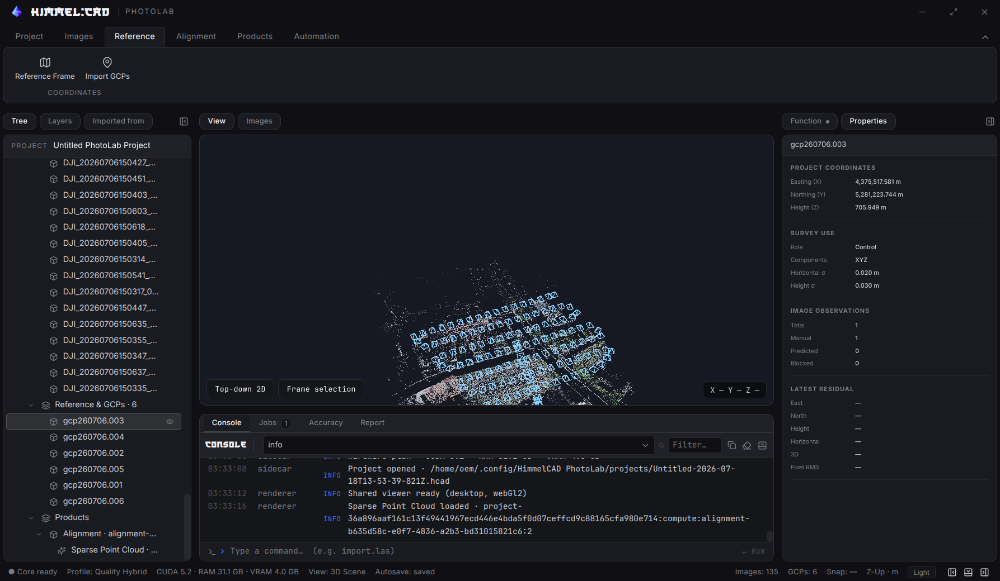

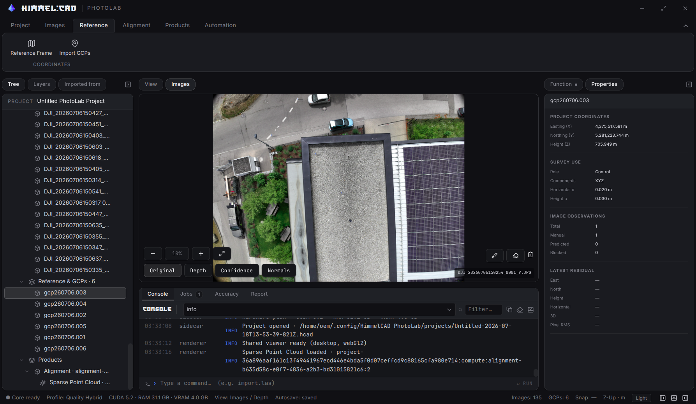

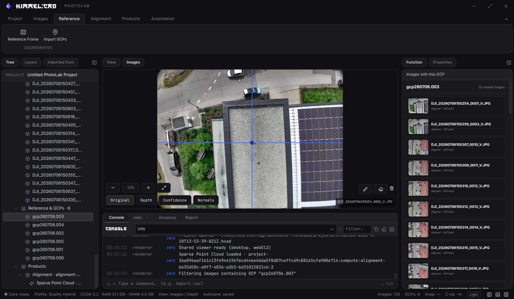

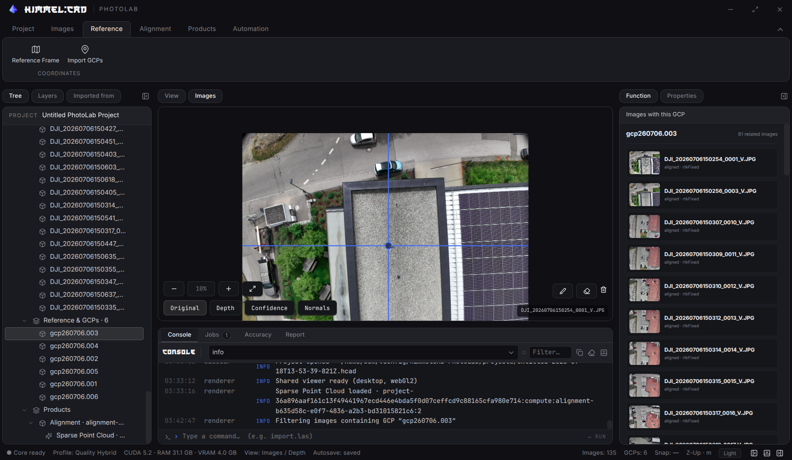

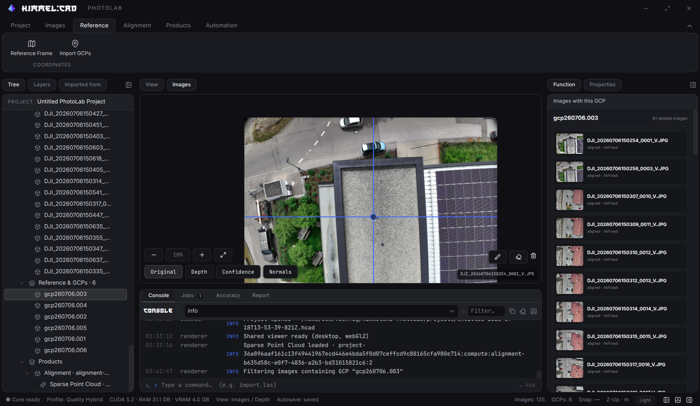

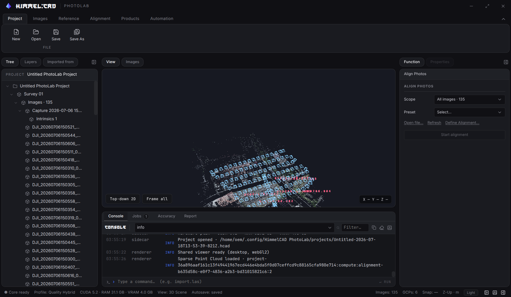

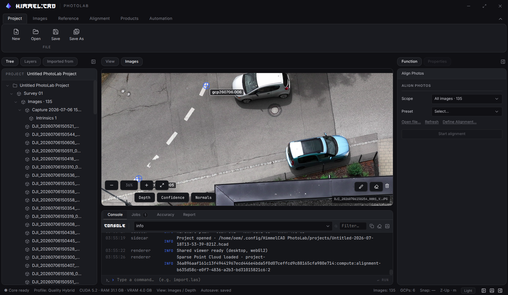

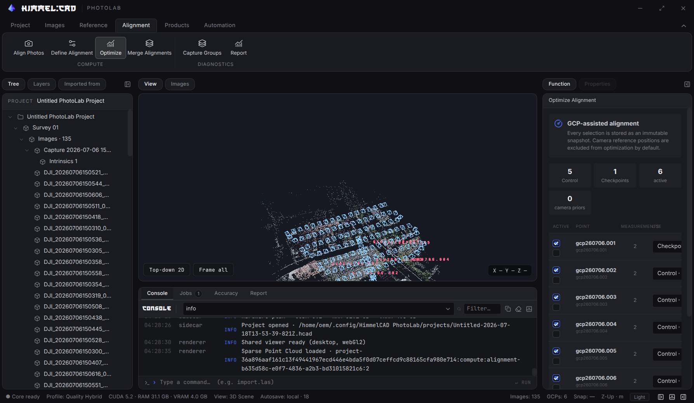

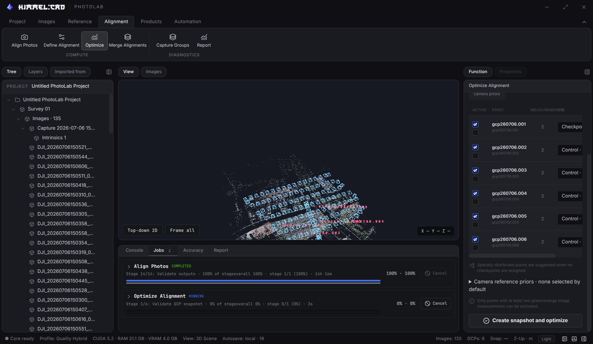

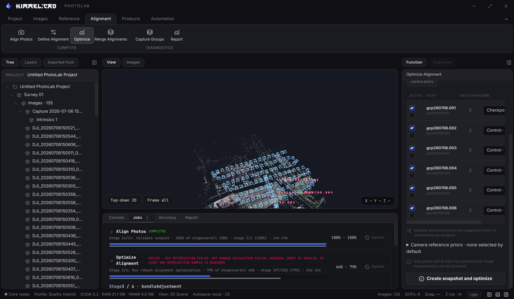

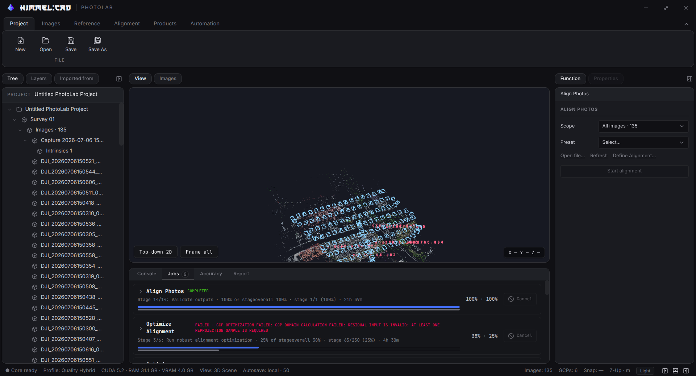

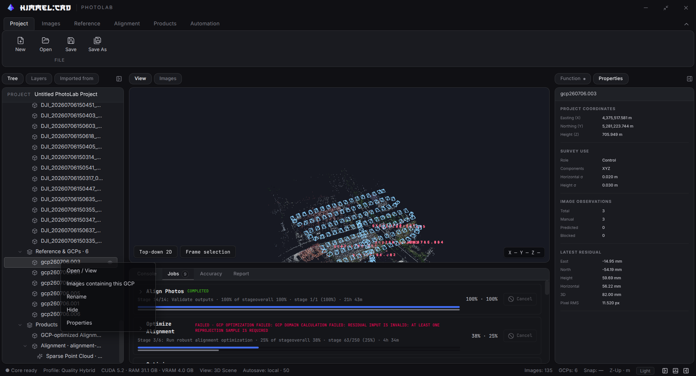

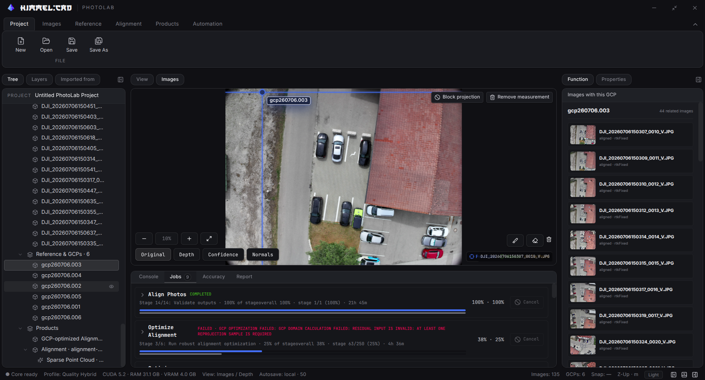

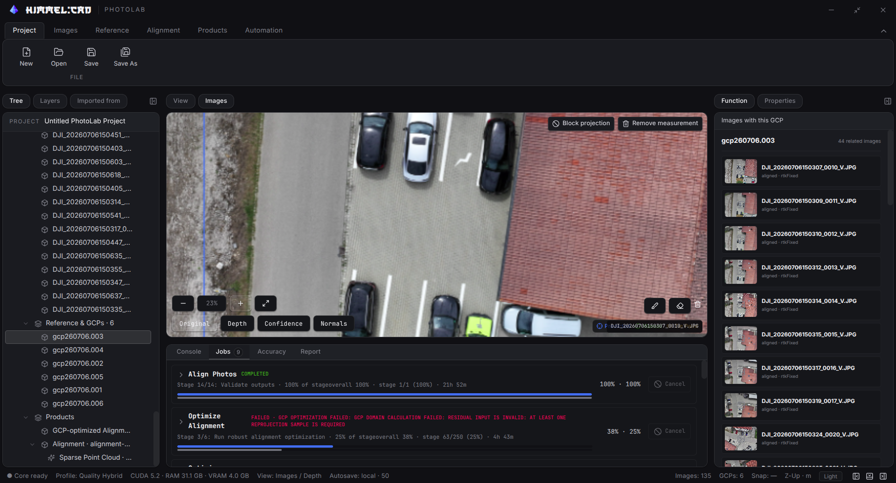

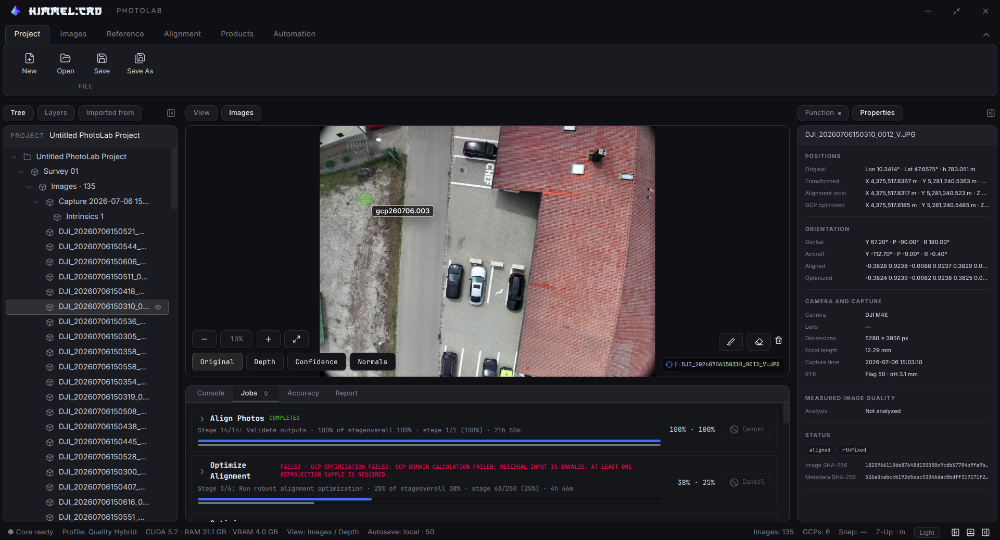

The active cross is now a sibling of the transformed image layer. Its geometry is recomputed in viewport pixels, so browser layer scaling cannot rasterize it; line thickness, hit width, center and label remain screen-constant. Dragging an axis preserves the original cursor-to-center offset instead of snapping the center beneath the pointer.

## Verification

- PhotoLab renderer and Electron typechecks pass, including the English-UI audit.
- All 18 GCP optimization tests pass, including projected-coordinate numerical stability, robust outlier initialization, radial-distortion fold rejection, invalid-projection penalties and checkpoint isolation.
- The 3D view was reopened after filtering and image measurement; sparse cloud, cameras and GCP labels remained available.
